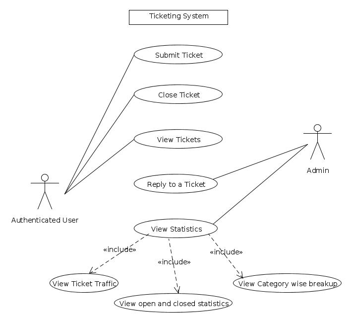
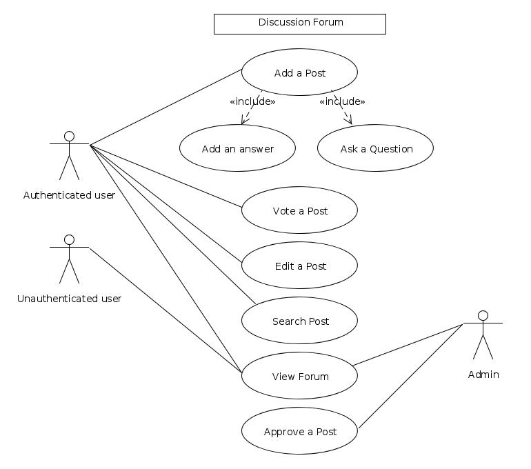
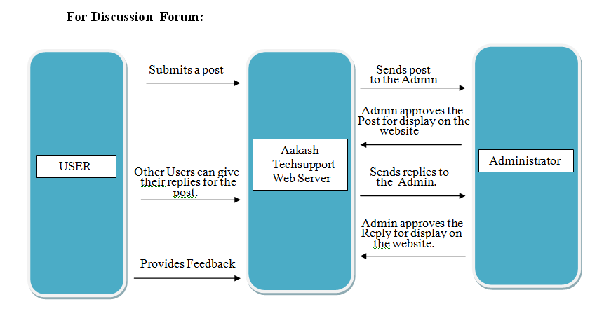
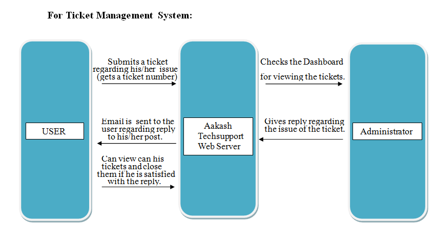
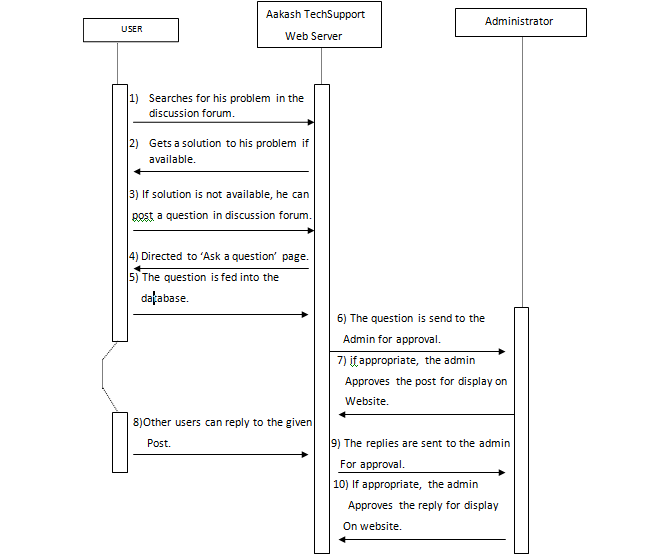
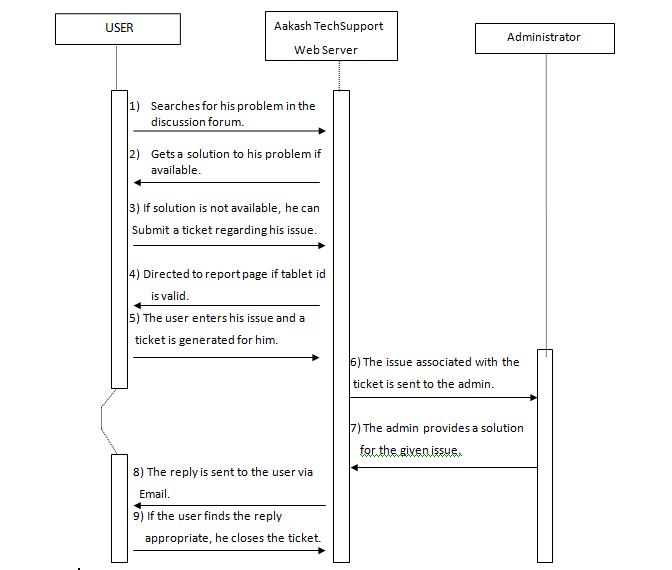
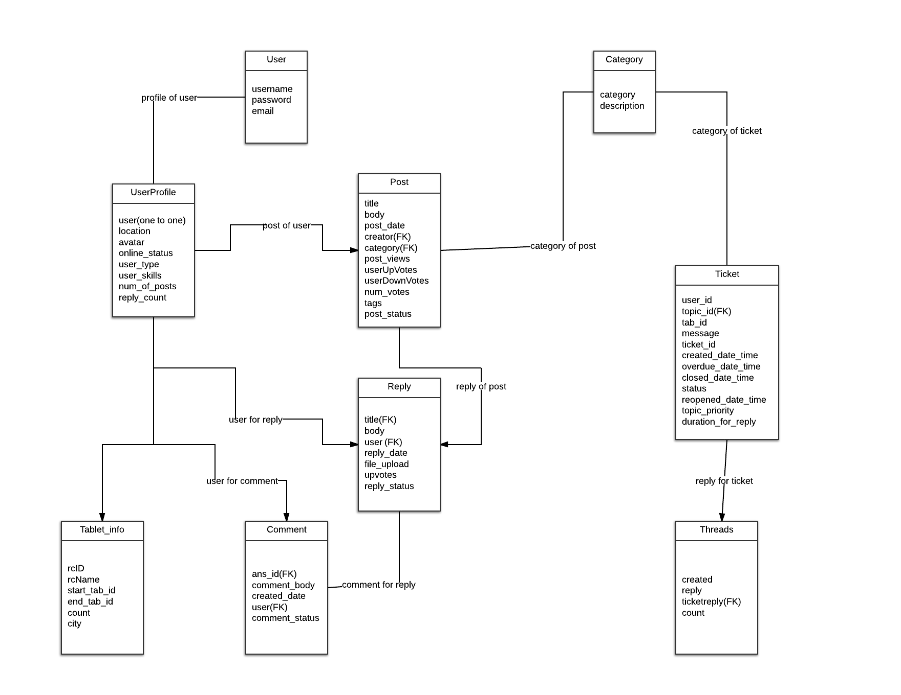

Acknowledgement
===============

We the summer interns team of Aakash Portal are overwhelmed in all humbleness and gratefulness to acknowledge our depth to all those who have helped us to put our ideas and assigned work, well above the level of simplicity and into something concrete.

We all thank whole heartedly Prof. Deepak Phatak for selecting us a part of his valuable project, constantly motivating for doing better and showing complete confidence in our work.

We are indebted to our Project Manager Mr. Parag Tiwari for his constant help and support in light of this project.We is very thankful to our mentors Tushar Sharma for his valuable suggestions, guidance and encouragement. Also in the process, we learnt a lot other technical and non technical things from them.

Finally we also like to thank all other colleagues working in different projects under Prof. Phatak for helping us at small problems as well as critical junctures.

Contributors
============

+----------------------+---------------+---------------------------+
|       Name           |    College    |          Email-id         |
+======================+===============+===========================+
|  Anurag Baidyanath   |   NIT Patna   |  anurag.fadia@gmail.com   |
+----------------------+---------------+---------------------------+
| Shaswat Sunder Nayak |CET Bhubaneswar|  shaswatsunder@gmail.com  |
+----------------------+---------------+---------------------------+
|     Som Pathak       |  SVNIT Surat  |   sompathaka@gmail.com    |
+----------------------+---------------+---------------------------+
|    Kavleen Kalra     | MBMEC Jodhpur |  kavleen.kalra@gmail.com  |
+----------------------+---------------+---------------------------+
|    Shubham Utwal     |  VNIT Nagpur  |  shubhamutwal@gmail.com   |
+----------------------+---------------+---------------------------+

Mentors
-------

* Mr Parag Tiwari
* Mr Veerendra Kumar Verma
* Mr Tushar Sharma

Declaration
===========

We declare that this written submission represents our ideas in our own words and where others' ideas or words have been included. We have adequately cited and referenced the original sources. We also declare that we have adhered to all principles of academic honesty and integrity and have not misrepresented or fabricated or falsified any idea/data/fact/source in our submission. We understand that any violation of the above will be cause for disciplinary action by the Institute and can also evoke penal action from the sources which have thus not been properly cited or from whom proper permission has not been taken when needed.

**Aakash Portal Team**
**Date:** 30-06-2013

Introduction
============

Enhancements to Aakash Tech Support Portal is a MHRD Project developed by summer interns at IITB under the guidance of *Prof. Deepak Phatak*. Aakash Tech support Portal is a place where one can share ideas, discuss issues and effectively collaborate with one another towards solving problems associated with the Aakash tablet.
In case the user cannot find his answers on discussion forums he can submit a ticket for the admin to answer his query.

Documentation Purpose
---------------------

The purpose of this document is to present a detailed description of Aakash Tech Support System. It will explain the purpose and features of the system, the interfaces of the system, what the system will do, the constraints under which it must operate and how the system will react to external stimuli. This document is intended for both the stakeholders and the developers of the system .The features discussed in this document are mainly functional requirements. These requirements are described in software development perspective to easily grasp by use. It also covers the non-functional requirements like performance, reliability, availability, security and maintainability.

Project Scope
-------------

With the continued evolution in technology, portal is becoming more and more essential now-a-days, where user can freely express their thoughts, ideas and discuss their issues that they are currently facing with the technologies and products they use.Aakash portal provides a convenient and easy-to-use graphical user interface to use.

The Aakash Tech Support portal is divided into two modules:

- *Discussion Forums*: Aakash Tech support portal's Discussion forums provides a platform where Aakash tablet users can share and clarify their issues which they are facing with Aakash tablet.
- *Ticketing system*: The ticketing system enables user to submit tickets related to his issues in case he cannot find his answers on discussion forums. It also enables the admin to answer his query and view statistics related to ticket traffic and category wise breakup of tickets.

Aakash Tech Support Portal is an Open Source software i.e. Aakash Tablet user can utilize the resources available on portal without any cost. Therefore it is going to be freely available. It is Platform- Independent and easy to operate and maintain.

Intended Audience and Document Overview
---------------------------------------

This document will be the first guide for prospective software developers, project managers, testers and most importantly users of Aakash tablet. This document contains software functionality, software and hardware requirements and user documentation.

- *Developer*: The developer who wants to read, change, modify or add new requirements into the existing program may need first to consult this document and update the requirements in appropriate manner so as not to change the actual purpose of the system or make the system inconsistent.
- *User*: The user of this program reviews the diagram and the specification provided in the document and check to determine whether the software has all the suitable requirements and if the software developer has the implemented all of them. He can also consult the user guide in the event of any confusion for clarifications.
- *Tester*: The tester needs this document to prepare his test cases to validate that the initial requirements of this project is actually implemented in the deliverable.

Definitions, Acronyms and Abbreviations
---------------------------------------

* Python:

It's a very-high-level dynamic object-oriented programming language.It's designed to be easy to learn, read and program. Python is a general purpose language, which means that many things are made easy like string processing, reading/writing files, sockets, websites, databases, GUI’s. Also it's dynamic i.e. new code can be executed during runtime without limitations.

* Django:

It's a high-level Python Web framework that encourages rapid development and clean, pragmatic design.Django follows the model–view-controller architectural pattern.

* HTML5:

HTML5 is a core technology markup language of the Internet used for structuring and presenting content for the World Wide Web. It is the fifth revision of the HTML standard. It's core aims have been to improve the language with support for the latest multimedia while keeping it easily readable by humans and consistently understood by computers and devices (web browsers, parsers, etc.). HTML5 is intended to subsume not only HTML 4, but also XHTML 1 and DOM Level 2 HTML.

* GIT:

Git is a free and open source distributed version control system designed to handle everything from small to very large projects with speed and efficiency.Git allows groups of people to work on the same documents (often code) at the same time, and without stepping on each other's toes.

Document Conventions
--------------------
In general this document prioritizes in writing the requirements of the system and analyzing in details the tools being provided to its users. Every requirement is having its own priority (none conflicting). In addition few figures are also being provided to make requirements more clearly to the reader.

References 
----------

* `https://docs.djangoproject.com/en/1.6/ <https://docs.djangoproject.com/en/1.6/>`_
* `http://www.tangowithdjango.com/book/ <http://www.tangowithdjango.com/book/>`_
* `http://www.swaroopch.com/notes/python/ <http://www.swaroopch.com/notes/python/>`_
* `http://stackoverflow.com/ <http://stackoverflow.com/>`_

List of Diagrams
================

A list of diagrams.

- Use case diagram of the Ticketing System 

- Use case diagram of the Login and Registration system 

- Use case diagram for Discussion Forum

- Level 0 data flow diagram for Aakash Portal 

- Level 1dat a flow diagram for Aakash Portal 

- Flow chart for Report Problem 

- ER diagram for Database 

Product Perspective 
===================

The product is supposed to be an open source, under the GNU general Public License. It is a web based system implementing client-server model. The Aakash portal System provides simple mechanism for users to share and acquire knowledge.

The following are the main features that are included in Aakash Portal

- Cross platform support: Offers operating support for most of the known and commercial operating systems.

- User account: The system allows the user to create their accounts in the system and provide features of updating and viewing profiles. 

- Number of users being supported by the system: Though the number is precisely not mentioned but the system is able to support a large number of online users at a time.

- Search: search is simply local search engine based on key words.

- Discussion Forum: Provides users with a platform to discuss and help each other with their problems

- Ticketing system: Allows user to submit his issue to the admin in case his problems are not solved by FAQs and discussion forums.

- FAQs section: Frequently asked section contain answer of problem which Aakash tablet user frequently faced.

User Characteristics 
--------------------

It is considered that the user do have the basic knowledge of operating the internet and to have access to it. The administrator is expected to be familiar with the interface of the tech support system.

Operating Environment
---------------------

This is a web based system and hence will require the operating environment for a client and server GUI. This will be operating in the following operating environment:

Dependencies 
------------

- This software highly depends on type and version of browser being installed in the system i.e. browser version should be used which have HTML5 support.

Design and Implementation constraints
-------------------------------------

This system is provisioned to be built on the Django framework which is highly flexible.Decision regarding which database to use should be taken considering the fact that data being exchanged or stored is large, and the appropriate data management system will yield efficient performance.

Specific Requirements 
---------------------

External user Requirement
+++++++++++++++++++++++++
- Hardware Interface

Device should be enabled with Internet.

- Software interface

The user's browser should be HTML5 compatible for a satisfactory user experience.

Functional Requirements
=======================

Major functions of the Discussion Forums
----------------------------------------
- Enable a user to view questions and their corresponding answers.
- Enable a logged in user to ask questions.
- Enable a logged in user to post answers.
- Enable a logged in user to upvote and downvote answers.
- Provide an interface for the admin to approve posts so that posts are not visible without admin approval
- Enable the admin to generate reports which contains all the posts and their corresponding replies

Major functions of the Login and Registration System
----------------------------------------------------
- Authenticate and Login user to the webapp.
- Enable new users to register to the tech support system.
- Enable a registered user to change his password if he forgets his password.
- Enable a registered user to update his profile which includes his location, skills and profile picture.
- Enable a registered user to view his profile. Additional information viz. questions asked by him and answers posted by him are also displayed.

Major functions of the Ticketing System
---------------------------------------
- Enable a registered user to submit a ticket, which contains a detailed explanation to his problem.
- Enable a registered user to view his submitted tickets.
- Enable a registered user to close a ticket submitted by him.
- Enable the admin to view open and closed tickets.
- Enable the admin to post a reply to a submitted ticket.
- Enable the admin to view ticket statistics viz. open and closed tickets breakup, ticket traffic, category-wise breakup of tickets.
- Enable the admin to generate reports which contains details of all the tickets submitted so far.The admin can also select which particular details he wants through an interface.

FAQs (frequently asked questions)
---------------------------------

In this section, solution of General problem that user currently facing in Aakash Tablet is provided.FAQ Contains solutions to general problems. 
Both Logged in user and Guest can see the Solution. 

Here Problem is divided into 3 sections they are: 

- Hardware Problem: Contains solution of Hardware Related Problem. 

- Software Problem: Contains solution of Software related problem. 

- General Problem:   Here solution of General Problem is provided. 

If user is not satisfied with the solution provided, Logged-in user can submit a ticket to get his problem solved.

Behavioral Requirements
=======================

Behavioural requirements of the system are described using use case view. The Following use case diagrams summarize the functional and behavioural requirements of the Aakash Portal.

- Use case diagram of the Ticketing System

- Use case diagram of the Login and Registration system

.. figure:: _static/img/LoginRegSystem.jpg
   :height: 600 px
   :width: 900 px
   :scale: 50 %
   :alt: Use case diagram of the Login and Registration system
   :align: center

- Use case diagram for Discussion Forum

Non Functional Requirements 
===========================

Performance Requirements
------------------------

- Performance

The system must be interactive and the delays involved must be less .So in every action-response of the system, there are no immediate delays. In case of opening windows forms, of popping error messages and saving the settings or sessions there is delay much below 2 seconds, In case of opening databases, sorting questions and evaluation there are no delays and the operation is performed in less than 2 seconds for opening ,sorting, computing, posting > 95% of the files. Also when connecting to the server the delay is based editing on the distance of the 2 systems and the configuration between them so there is high probability that there will be or not a successful connection in less than 20 seconds for sake of good communication.

- Safety

Information transmission should be securely transmitted to server without any changes in information

- Reliability

As the system provide the right tools for discussion, problem solving it must be made sure that the system is reliable in its operations and for securing the sensitive details.

Software Quality Attributes
---------------------------

- Availability

If the internet service gets disrupted while sending information to the server, the information can be send again for verification.

- Security

The main security concern is for users account hence proper login mechanism should be used to avoid hacking. The tablet id registration is way to spam check for increasing the security. Hence, security is provided from unwanted use of recognition software.

- Usability

As the system is easy to handle and navigates in the most expected way with no delays. In that case the system program reacts accordingly and transverses quickly between its states.

Diagrammatic Descriptions
=========================

Data Flow Diagrams for Aakash Tech Support Portal
-------------------------------------------------

- DFD for discussion forums

Data Flow Diagram for discussion forums

- DFD for ticketing system

DFD for ticketing system

Sequence Diagrams
-----------------

- Sequence diagram for discussion forums

Sequence Diagram for discussion forums

- Sequence diagram for ticketing system

Sequence Diagram for ticketing system

Flow Chart for Reporting a Problem
----------------------------------

.. figure:: _static/img/flowchart.png
   :height: 600 px
   :width: 900 px
   :scale: 50 %
   :alt: Flow Chart for Reporting a Problem
   :align: center

Flow Chart for Reporting a Problem

Entity relationship diagram
---------------------------

ER Diagram for Database

Conclusion
==========

With the continued evolution in technology, portal is becoming more and more essential now-a-days, where user can freely express their thoughts, ideas and discuss their issues that they are currently facing with the technology, this is where Aakash Portal come in picture ,which provided a platform for Aakash users to discuss their issues that they are facing with the Aakash Tablet, as well as Aakash portal create an online platform which brings developers together and facilitates application development and improvement. Aakash Portal also solves the Problem very precisely and dedicatedly for each and every user .The design of this portal is very simple and user-friendly too, which make it more efficiently. Thus we can say that Aakash portal has a great scope in future for the users of Aakash tablet and Developers too.
